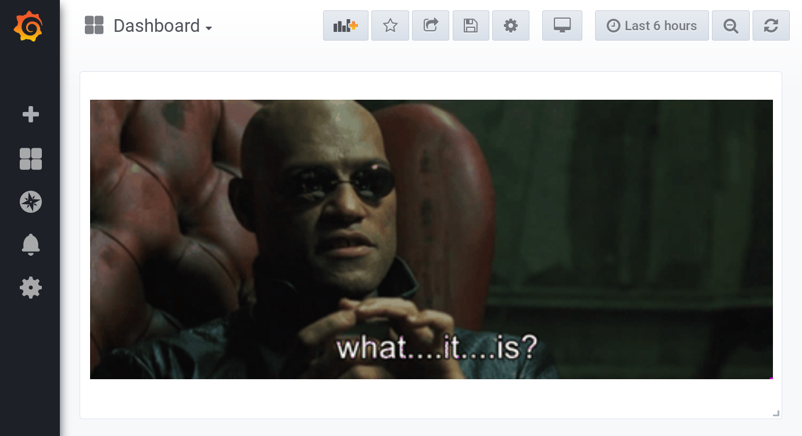
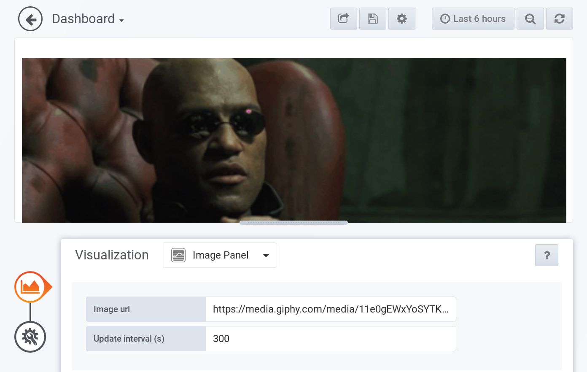

# grafana-image-panel

Shows and refreshes an image. That's it.

We have a slackbot running at work that accepts image URLs and we show the
current image on one of our grafana dashboards.

Right now it's about 5 lines of plain JavaScript to embed the image and
refresh it from time to time. This repository is an attempt to complicate
things... or rather learn a thing or two about grafana plugins. :-)

**Developed against Grafana 6.0.x**

## Screenshots

## Setup

Install dependencies:

`$ yarn`

Make a production build:

`$ yarn build`

Continously build the plugin:

`$ yarn watch`

## Development

I'm using docker to run grafana and point it's plugin directory to this
repository:

`$ docker run -p 3000:3000 -v $(pwd):/plugins/ -e GF_PATHS_PLUGINS="/plugins/" grafana/grafana:6.0.2`

Open `localhost:3000` in your browser and add the image panel.
